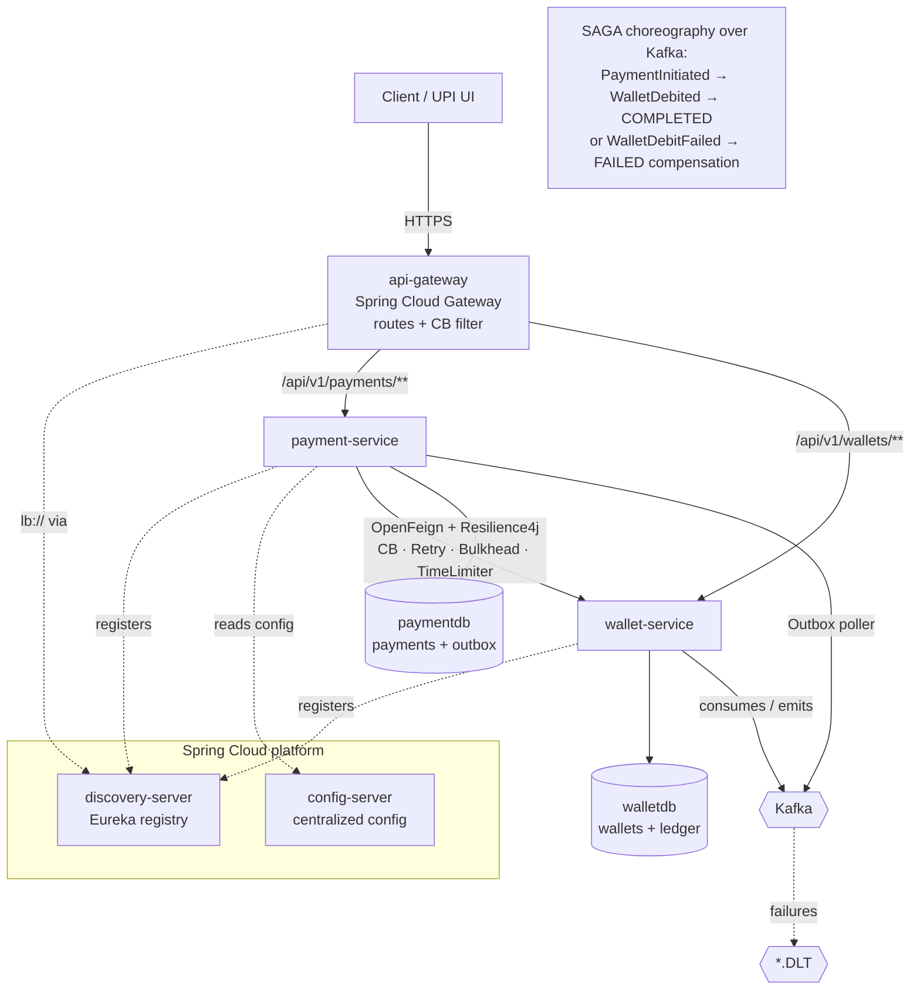
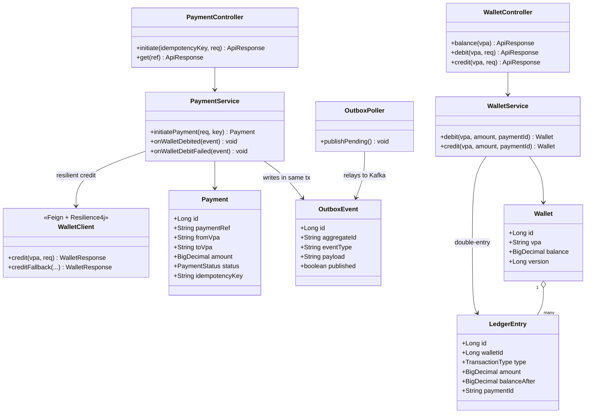
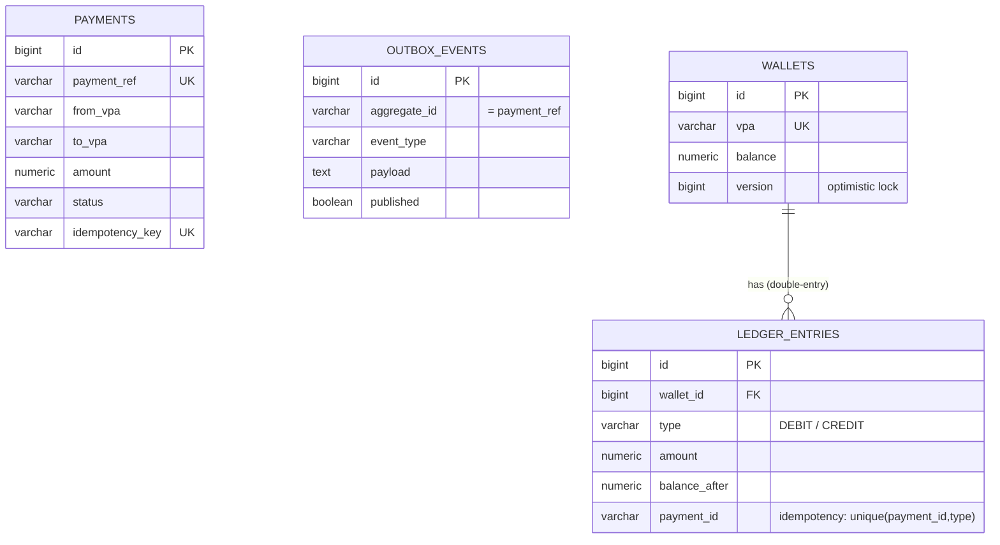
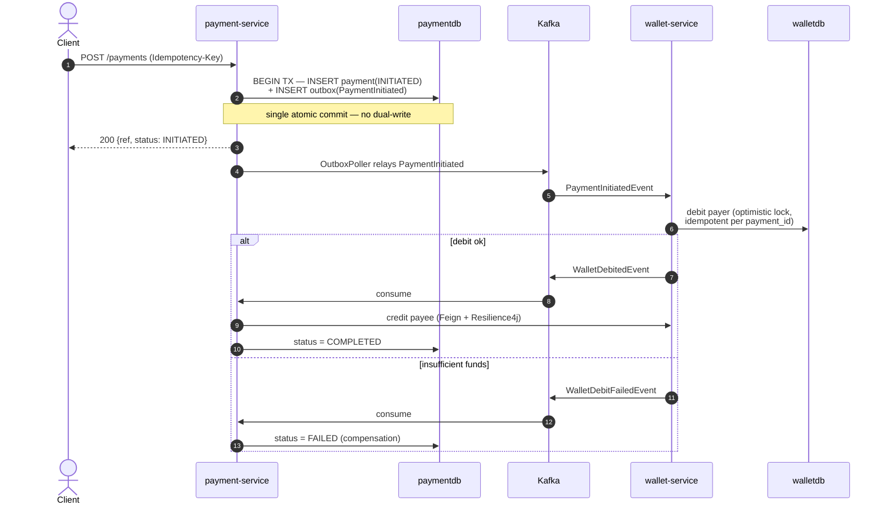
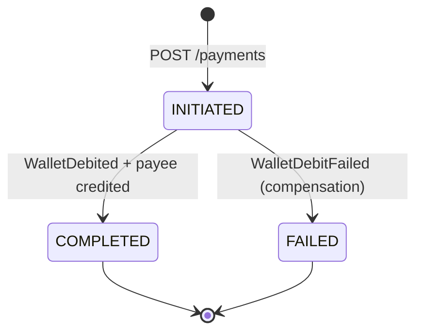

# UPI Payment System — Diagrams

Mermaid diagrams generated from the actual services (`payment-service`, `wallet-service`),
their entities, and the Spring Cloud topology.

- [1. High-Level Design (HLD)](#1-high-level-design-hld)
- [2. UML Class Diagram](#2-uml-class-diagram)
- [3. Entity-Relationship Diagram](#3-entity-relationship-diagram)
- [4. SAGA + Outbox Sequence](#4-saga--outbox-sequence)
- [5. Payment State Machine](#5-payment-state-machine)

---

## 1. High-Level Design (HLD)

---

## 2. UML Class Diagram

---

## 3. Entity-Relationship Diagram

Two databases (one per service — the database-per-service pattern). No cross-service FKs;
services are linked only by `payment_id` carried in events.

---

## 4. SAGA + Outbox Sequence

The headline flow: a transfer as a choreographed distributed transaction.

---

## 5. Payment State Machine

